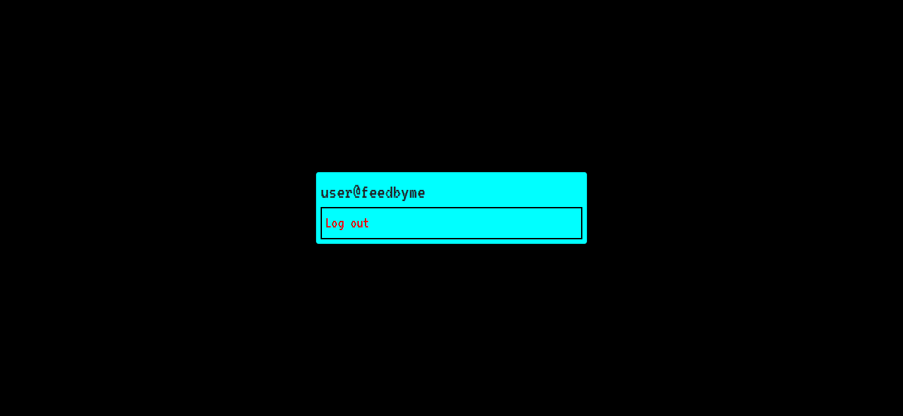

# Django-login

A simple login application made in Django and SQL. It uses django's own authentication system. It is very customizable.

**Requirements**

1. Check Requirements.txt

# Getting Started

- Clone this repository by this command.

  `git clone https://github.com/Badhan-abhishek/django-login`

- Open terminal or CMD in directory where **manage.py** exists.
- Change SECRET_KEY & database password in **Settings.py**
- Create a superuser with command `python3 manage.py createsuperuse`
- Run migrations by following commands.

1.  `python3 manage.py makemigrations`
2.  `python3 manage.py migrate`

- At last run server by following command `python3 manage.py runserver`

> **NOTE :-** \
>
> - Windows user need to use `python manage.py [command]` \
> - Application name is login_app

# Usage

Use to integrate in your project. The application is themed uniformly.

# Screenshots

1. Login
   

2. Register
   

3. Forget password
   

4. After login
   
